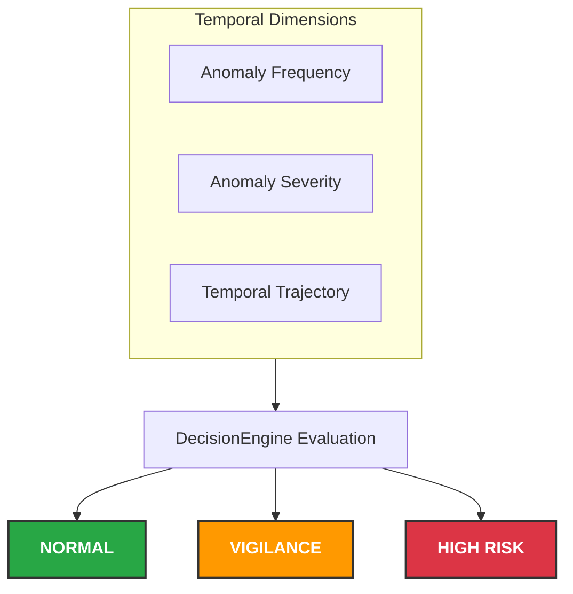
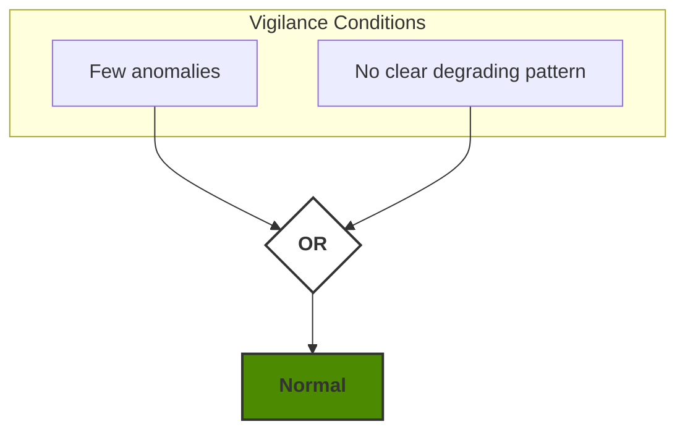
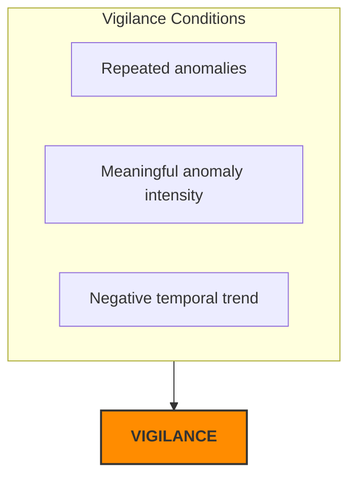
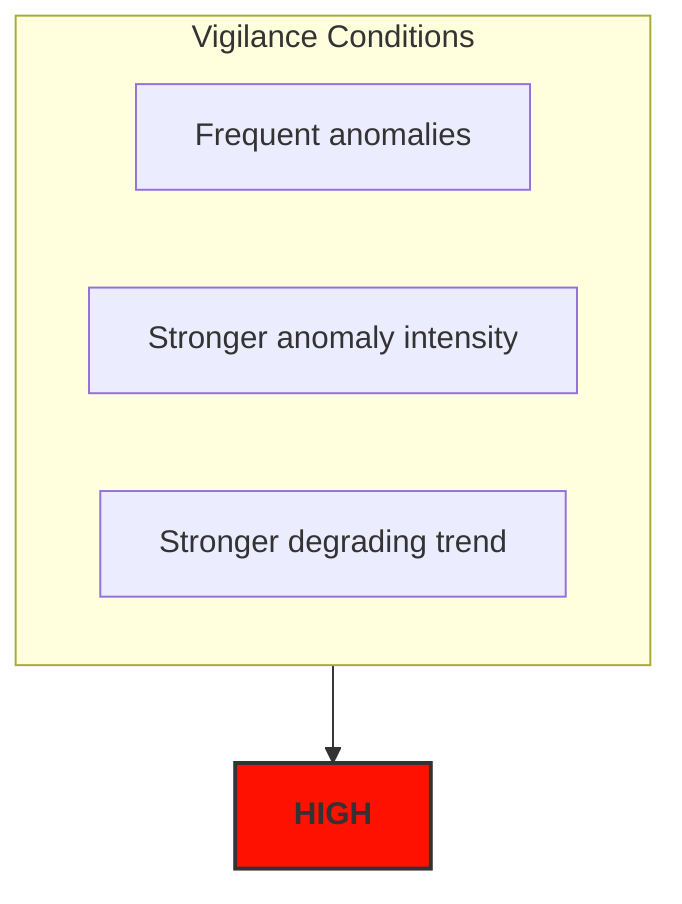
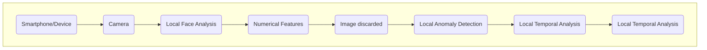
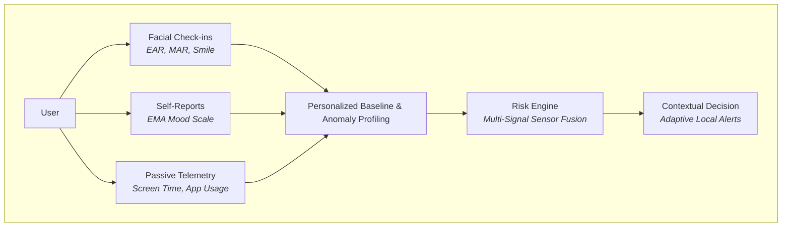

# Facial Vigilance Analysis

### Personalized On-Device Behavioral Anomaly Detection

**Facial Vigilance Analysis** is an experimental computer vision and machine learning project exploring privacy-preserving and personalized behavioral change detection.

The project currently uses facial features extracted from images to learn an individual behavioral baseline and identify unusual patterns over time.

The long-term objective is to combine facial analysis with self-reported mood and lightweight smartphone behavioral signals while keeping sensitive processing on-device.

> **Disclaimer:** This project is an experimental and educational prototype. It is not a medical device and does not diagnose mental-health conditions.

---

## Project Motivation

Facial Vigilance Analysis started as a personal project exploring how computer vision and machine learning could be used to build a more personalized wellbeing application.

The idea is simple: users complete short daily check-ins by reporting how they feel, while the application locally extracts a small set of facial features. Over time, the system builds a personal baseline and looks for meaningful changes in recent patterns.

The goal is not to determine someone's emotional state from a single picture, but to use multiple check-ins to better understand changes over time.

Ultimately, the project is intended to evolve into a **privacy-first mobile application** that can use these signals to provide simple and positive suggestions when appropriate.

The long-term vision is to combine facial features, self-reported mood, and lightweight behavioral signals while keeping sensitive data and analysis on the user's device whenever possible.

For example, the application could suggest:

- going for a walk;
- discovering an activity nearby;
- visiting a park or interesting place;
- taking a break from the screen;
- doing a small physical activity;
- trying something enjoyable based on the user's interests.  

---

## Current Pipeline

The current version of the project follows this pipeline:

1. An image is processed with `MediaPipe Face Landmarker`.
2. Facial landmarks and blendshapes are used to extract a few features:
   - average eye aspect ratio (EAR)
   - mouth aspect ratio (MAR)
   - smile score
3. The extracted features are saved as a check-in in the dataset.
4. Features are standardized with `StandardScaler`.
5. An `IsolationForest` learns the user's baseline and produces an anomaly score for each check-in.
6. The last 7 check-ins are analyzed using:
   - number of anomalies
   - average anomaly intensity
   - anomaly score trend
7. These values are passed to the `DecisionEngine`, which currently returns one of three states: `NORMAL`, `VIGILANCE`, or `HIGH`.

The current version is still a prototype. The thresholds used by the decision engine are experimental and will need to evolve.

---

# 1. Computer Vision

The computer vision pipeline uses `MediaPipe Face Landmarker` to detect facial landmarks and facial blendshapes.

`OpenCV` is used for image loading, processing, and optional debug visualization.


## Facial Landmarks

MediaPipe provides normalized facial landmarks.

These landmarks are mapped to pixel coordinates before being passed to the feature extraction pipeline.

Debug visualization can optionally display selected landmarks on the input image.

---

# 2. Feature Extraction

Raw facial landmarks are converted into a small set of interpretable numerical features.

The current implementation extracts:

```text
left_eye_ear
right_eye_ear
average_eyes_ear

mouth_openness_mar

smile_left
smile_right
smile_score
```

## Eye Aspect Ratio — EAR

Eye Aspect Ratio is calculated using selected landmarks around each eye.

Both eyes are evaluated independently:

```text
left_eye_ear
right_eye_ear
```

Their average is then calculated:

```text
average_eyes_ear
```

The average EAR is currently used as one of the features for anomaly detection.

---

## Mouth Aspect Ratio — MAR

Selected mouth landmarks are used to estimate mouth openness.

The resulting feature is stored as:

```text
mouth_openness_mar
```

---

## Smile Score

MediaPipe facial blendshapes provide smile-related scores for both sides of the face:

```text
smile_left
smile_right
```

These values are combined into:

```text
smile_score
```

---

## Features Used by the Current ML Pipeline

The current anomaly detector uses:

```python
FEATURES_COLS = [
    "average_eyes_ear",
    "mouth_openness_mar",
    "smile_score"
]
```

This means that hundreds of raw facial landmarks are reduced to a small numerical representation before being passed to the machine learning pipeline.

---

# 3. Check-in Dataset

Each check-in generates a structured entry stored locally in `data/csv/features.csv` 

The current dataset contains fields such as:

```text
timestamp
mood

left_eye_ear
right_eye_ear
average_eyes_ear

mouth_openness_mar

smile_left
smile_right
smile_score
```

The self-reported `mood` value currently uses a scale from:

```text
1 -> low mood
...
5 -> high mood
```

At the current stage, `mood` is stored for analysis but is **not used as an input feature by the Isolation Forest**.

---

# 4. Exploratory Data Analysis

The project includes a small analysis script used to inspect the generated check-in dataset during development.

It currently provides:

- descriptive statistics for the main features;
- mood distribution;
- Pearson correlation between selected features and self-reported mood;
- histograms for the main facial features.

The analysis is intended to help verify that the extracted features behave as expected and to understand how they vary across check-ins.

The personal dataset used during development is not included in this repository.

---

# 5. Data Preprocessing

Before anomaly detection, the selected facial features are standardized using scikit-learn's `StandardScaler`:

- `average_eyes_ear`
- `mouth_openness_mar`
- `smile_score`

The `mood` value is kept separate and is not currently used by the facial anomaly detection model.

---

# 6. Personalized Anomaly Detection

The current system uses **Isolation Forest** from scikit-learn.

The objective is not to classify a universal emotional state.

Instead, Isolation Forest is used to identify observations that differ from the patterns represented in the user's baseline data.

The model produces two important outputs.

#### `is_anomaly`

```text
 1 -> observation classified as normal
-1 -> observation classified as anomalous
```

#### `anomaly_score`

The continuous score is obtained using:

```python
decision_function()
```

The score provides additional information beyond the binary prediction.

Values below the model's decision boundary correspond to observations classified as anomalous.

The magnitude of this score is treated only as a **model-relative anomaly indicator**. Not interpreted as a medical or psychological severity score.

---

# 7. Temporal Window Analysis

A single anomalous observation should not automatically trigger a warning.

The current prototype therefore analyzes the:

```text
7 most recent check-ins
```

using `WindowAnalyzer`.

> **Important:** In V1, this represents seven check-ins, not necessarily seven calendar days.

The current window produces three main indicators.

#### 1. Anomaly Frequency

The first indicator counts the number of anomalous observations inside the current window.

Example:

```text
3 anomalies / 7 check-ins
```

This answers:

> How frequently has unusual behavior recently occurred?

#### 2. Anomaly Intensity

Only observations classified as anomalies are selected.

Their `anomaly_score` values are averaged.

For example:

```text
-0.066
-0.082
-0.161
```

produces approximately:

```text
mean anomaly score = -0.103
```

This provides a compact representation of how far anomalous observations are positioned on the anomalous side of the Isolation Forest decision boundary.

If no anomalies are present, the current implementation can represent anomaly intensity as `0`.


#### 3. Temporal Trend

Frequency and intensity alone do not describe whether the situation is improving or degrading.

The system therefore calculates a simple linear slope of the anomaly scores across the current window using NumPy's `polyfit()`.

For example:

```text
+0.13
+0.07
+0.12
+0.09
-0.07
-0.08
-0.16
```

shows an overall decreasing pattern.

A linear regression is used to estimate the global direction of the observations rather than simply comparing the first and final values.

Conceptually:

```text
negative slope
-> scores are globally decreasing

slope close to zero
-> scores are relatively stable

positive slope
-> scores are globally increasing
```

In the context of the current Isolation Forest output, a sufficiently negative trend can indicate that recent observations are moving toward the anomalous side of the decision boundary.

---

# 8. DecisionEngine V1

The `DecisionEngine` transforms the temporal analysis into an interpretable system state.

It currently combines:



The current V1 supports three states:

```text
NORMAL
VIGILANCE
HIGH
```

## Normal

A small number of anomalies is considered insufficient to indicate a persistent pattern.

Similarly, anomalies without meaningful intensity or temporal degradation may remain classified as normal.



---

## Vigilance

Vigilance requires multiple indicators to agree.

Conceptually:



This prevents the system from reacting strongly to a single unusual observation.

---

## High

The `HIGH` state uses stricter conditions.

Conceptually:



The current thresholds are configurable prototype parameters.

They are **not statistically or medically validated thresholds**.

They will require further experimentation and calibration as the dataset and system evolve.

---

# 11. Privacy-First / On-Device Direction

A major objective of the project is to move toward a completely **on-device architecture**.

The target workflow is:




The target architecture should not require raw facial images to be uploaded to a remote server.

Future behavioral signals should follow the same privacy-first principle whenever technically possible.

---

# 12. Long-Term Multimodal Architecture

Facial analysis is intended to become only **one signal** among several.

The planned architecture is:



This is important for reducing false positives.

For example:

```text
Facial signal      -> unusual
Mood               -> normal
Behavior           -> normal
```

should not necessarily result in a strong warning.

In contrast:

```text
Facial signal      -> unusual
Mood               -> degrading
Behavior           -> unusual
```

provides multiple independent signals pointing in the same direction.

---

# 13. Technologies

### Computer Vision

- OpenCV
- MediaPipe Face Landmarker

### Machine Learning

- scikit-learn
- Isolation Forest
- StandardScaler

### Data Processing

- Python
- NumPy
- pandas

### Data Analysis

- descriptive statistics
- Pearson correlation
- linear regression / trend estimation

---

# 14. Current Project Status

**Current milestone**

The current prototype is capable of:

1. loading an image;
2. detecting a face;
3. extracting facial landmarks and blendshapes;
4. generating interpretable facial features;
5. creating structured check-in records;
6. building an experimental personal dataset;
7. normalizing facial features;
8. training an Isolation Forest;
9. detecting unusual observations;
10. generating continuous anomaly scores;
11. analyzing the seven most recent check-ins;
12. measuring anomaly frequency;
13. measuring mean anomaly intensity;
14. estimating temporal evolution;
15. producing a '*V1*' decision: `NORMAL`, `VIGILANCE`, or `HIGH`.

The next milestone is the introduction of self-reported mood as an independent temporal signal, followed by multimodal behavioral sensing.

---

# Disclaimer

Facial Vigilance Analysis is an *educational* and *experimental* research-oriented software project.

* *Non-Medical Scope*: This system is not a medical device and is not designed to diagnose, monitor, or evaluate clinical conditions (such as clinical depression, anxiety disorders, or medical chronic fatigue).

* *Hands-on AI & ML Exploration*: The real biometric observations and temporal decision models in this project serve as a practical foundation to dive into the fields of Artificial Intelligence and Machine Learning through an end-to-end engineering implementation.

The current dataset is small and user-specific, and all thresholds used by the DecisionEngine are prototype parameters requiring further experimentation and validation.